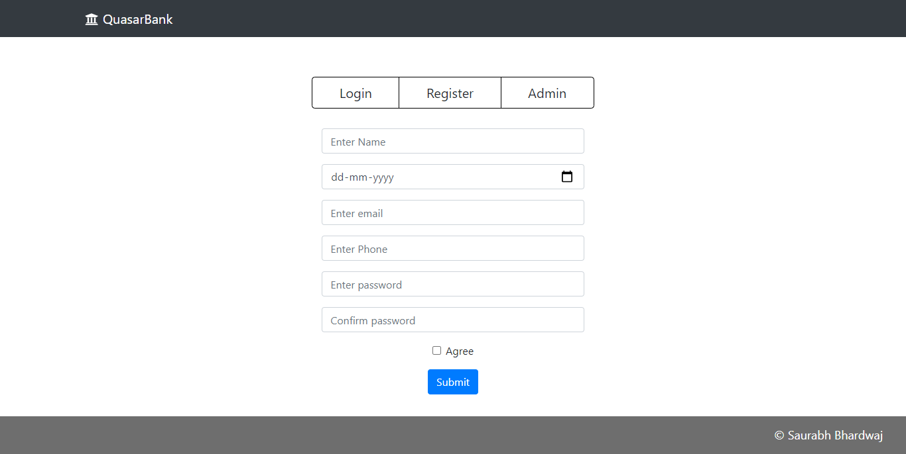
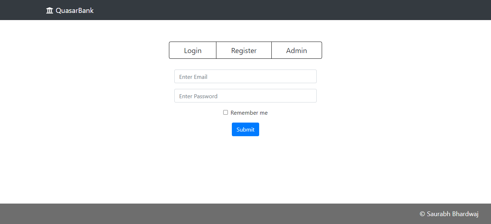
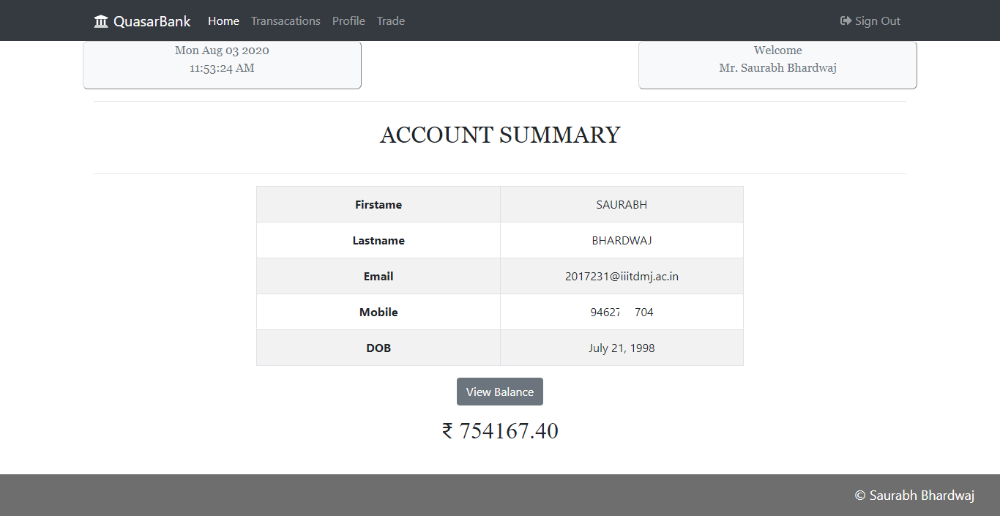
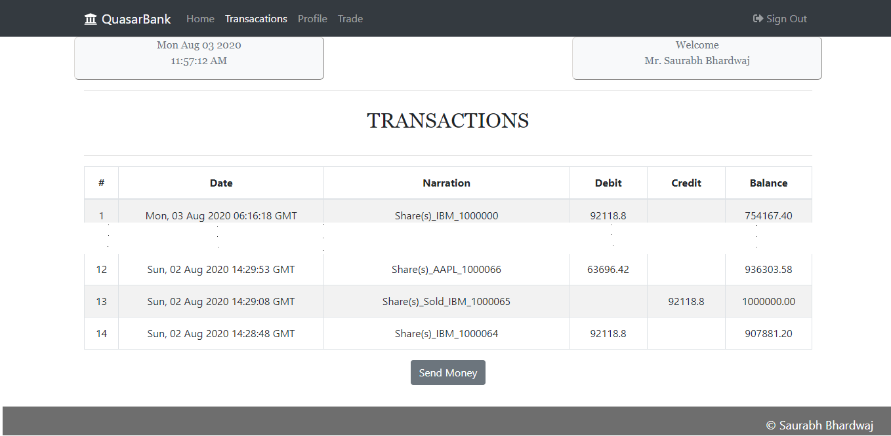
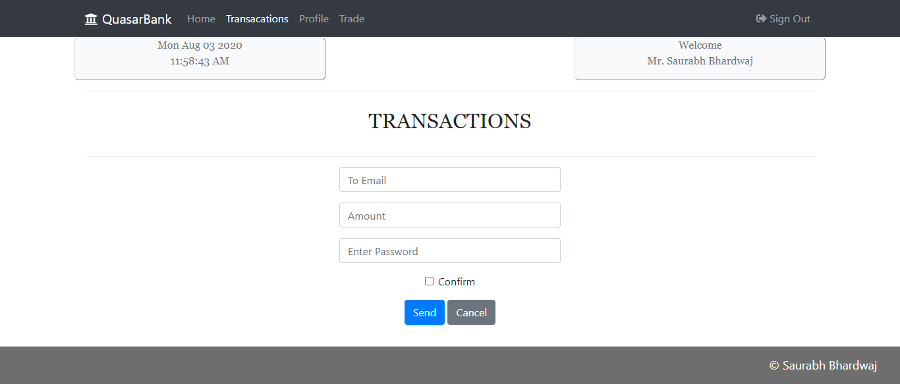
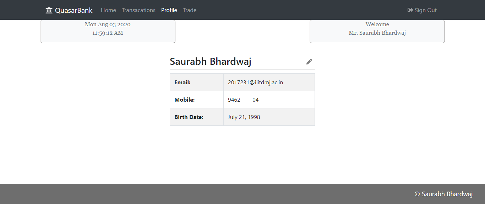
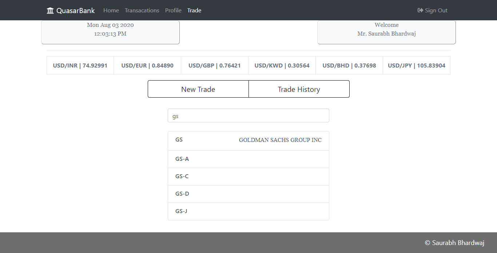
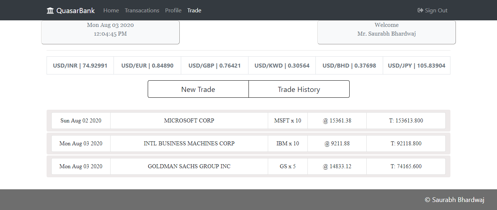
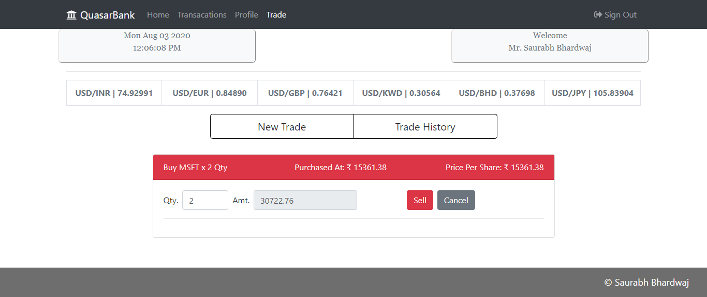

# QuasarBank

   A MERN application for Virtual Banking and Portfolio Management.

## Functionality
   Main Functionality is portfolio managament system, in which you can virtually invest money for practicing trading, all without risking any real money.
   You can buy/sell US Stocks, at real time pricing.

## How to Start

1) Clone the repository: `$ git clone https://github.com/saurabhb44/QuasarBank`
2) The app is built on MERN Stack, so the first thing you'll need is Node.js installed on your PC. 
    * [Install Node.js from Here](https://nodejs.org/en/download/)
3) MongoDB: 
    * on **Windows**
      * [Download for Windows](https://fastdl.mongodb.org/windows/mongodb-windows-x86_64-4.4.0-signed.msi)
    * on **Ubuntu**
      * [Download for Ubuntu](https://repo.mongodb.org/apt/ubuntu/dists/focal/mongodb-org/4.4/multiverse/binary-amd64/mongodb-org-server_4.4.0_amd64.deb)
4) Go to the QuasarBank Folder and install required packages using npm: `$ npm install`.
5) Initiate Admin Account and TransactionID generator on DB by running the script *One time only*: `$ node ./backend/adminRoutes/demo.js` & then end it.
6) Run the React app: `$ npm start`
7) Start the backend: `$ nodemon ./backend/index.js`
8) The react server runs at port 3000, so go to the url in the browser: `http://localhost:3000/`
9) Happy Banking!

## Usage:
1) Rgister as a Client

  

2) Login with registered Email & Password

  
  
3) Home

    
  
4) Bank Statement

  
  
5) Send Money to friend

  
  
6) Manage Profile

  
  
## Portfolio Management
You are given an initial Rs. 1,000,000, so it's time to start trading

### Buy Shares from US Stock Market
* Search for your favourite Stock
  
  
  
* Buy specifying the required Quantity on current rates in Rs

  
  
* View purchased stocks in Trade History

  
  
* Sell some or all stocks of specified company

  

* Trade History after selling

  

## Admin Routes
   Admin accounts are generated only on backend, but can be used on Client side.
   * Login to Admin Route using
      * Admin **AccountId**: `10001`
      * Admin **Password**: `adminpass`
   * Admin privileges
      * Admin can View all QuasarBank users
      * Admin can deposit any amount of money to any of the QuasarBank users (Just like a local bank branch)
      * Admin transactions are also listed
## Security
   * Any security vulnerability is threat to a banking website, so to overcome that, all the routes are protected using **JWT Authentication**.
   * Passwords are not directly stored on DB, but instead encrypted using **BcryptJs**.
   * All the tokens for accessing the routes are valid for 1 hour only.
   * Special thanks to **Finnhub.io** api which provides real time market data.
   
### For any Suggestions or Changes, feel free to contact I'll be really grateful to hear you!

Thank You & Stay Safe!
